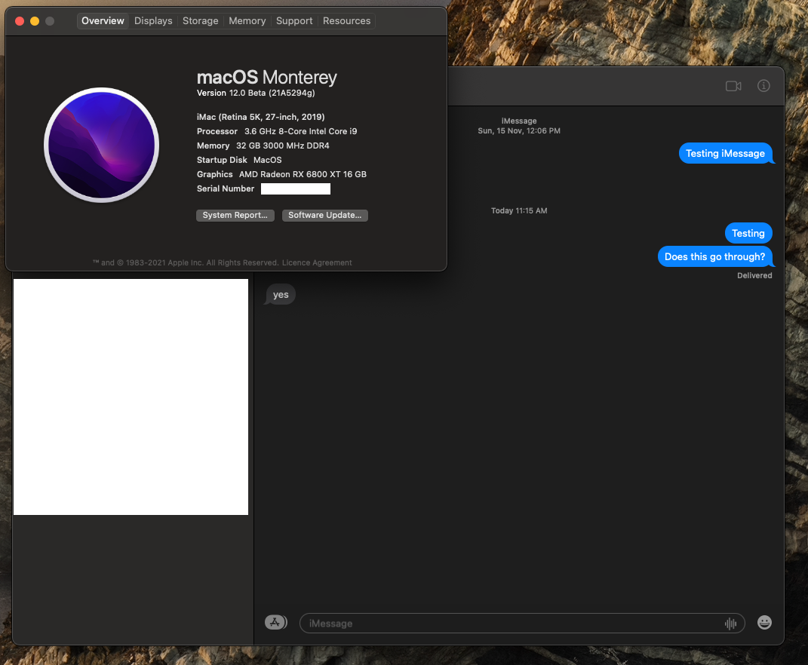

# Hackintosh configuration for an Asus Z390i using opencore. 

 

<strong> Hardware </strong>

 

| Category  | Component                            |
| --------- | ------------------------------------ |
| CPU       | [Intel Core i9-9900k](https://ark.intel.com/content/www/us/en/ark/products/186605/intel-core-i9-9900k-processor-16m-cache-up-to-5-00-ghz.html) |
| SSD       | [Adata XPG SX8200 Pro PCIe Gen3x4 M.2 2280 Solid State Drive](https://www.xpg.com/us/xpg/583) |
| Display   | [Prism Plus X315/C315 Max](https://prismplus.sg/products/prism-c315-max), Anmite 27 inch IPS |
| WiFi & BT | Dell DW1560 |
| GPU       | [Powercolor Red Devil RX580](https://www.powercolor.com/product?id=1493084304) |

- This motherboard was specifically selected because it was the only one in stock with a removable WiFi card. The stock WiFi card was removed and replaced with a DW1560.

<strong> Screenshots </strong>

USB Header Mappings taken from
[simonculton](https://github.com/simoncoulton/opencore-asus-rog-strix-z390i)

<strong> Features </strong>

  
| Feature  | Status                            |
| --------- | ------------------------------------ |
 | WiFi | :white_check_mark: |
 | iMessages | :white_check_mark: |
 | USB | :white_check_mark: |
 | Onboard Audio | :white_check_mark: |
 | Dual Screens through RX580 (DP/HDMI output) | :white_check_mark: |
 | Bluetooth | :white_check_mark: |
 | Sidecar (Both wired via USB-C <-> iPad Pro and wireless (same wifi network))  | :white_check_mark: |
 | Airdrop | :white_check_mark: |
 | Netflix DRM on Safari | :x:  Refer to [acidanthera](https://github.com/acidanthera/bugtracker/issues/1034) |
 
 
## A note about Sidecar.
For sidecar, you have to ensure that within BIOS, iGPU multi monitor mode is enabled, with a reserved memory of 64mb.

Even though in config.plist the reserved memory is set to 19mb for the iGPU, this will only act as a failover.

Take note to set the primary GPU to auto in BIOS if using a dGPU like I am.

## A note about netflix
in 11.4-beta3, it appears that having netflix open in chrome/ff and then subsequently opening Safari really fucks with it.

For now, just don't open safari while watching netflix.

